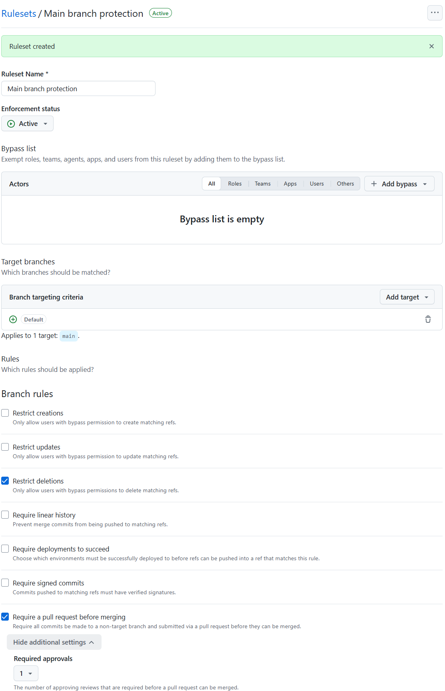
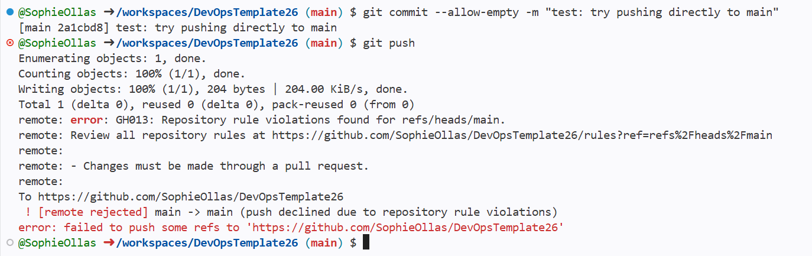
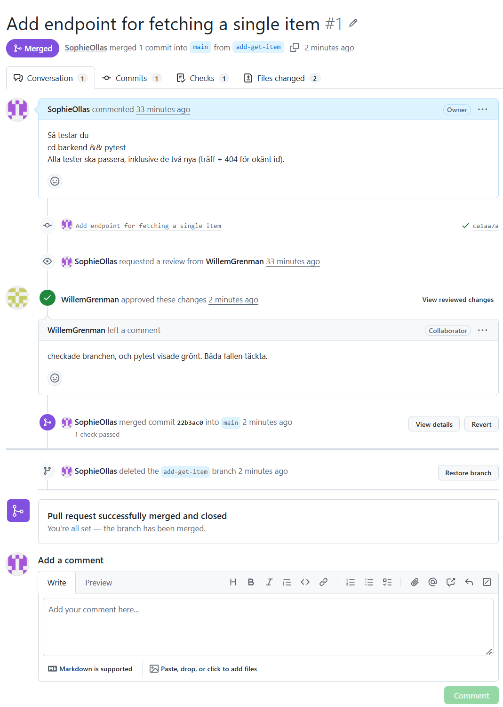
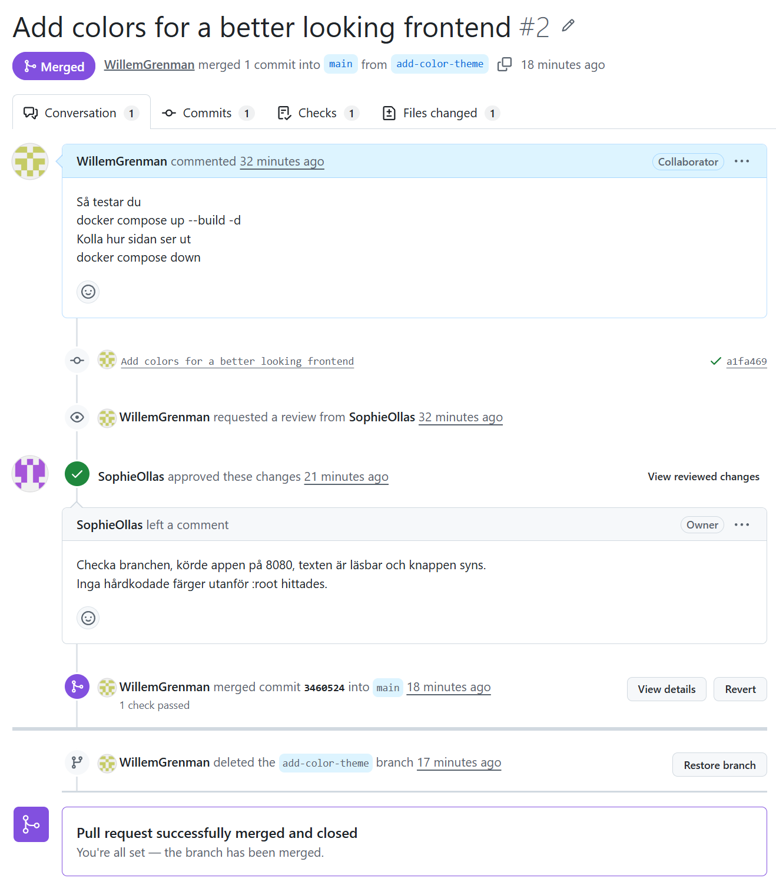
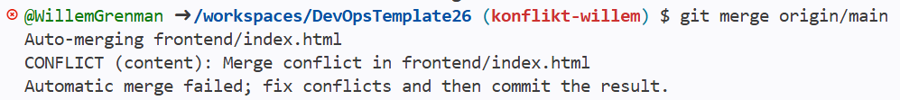
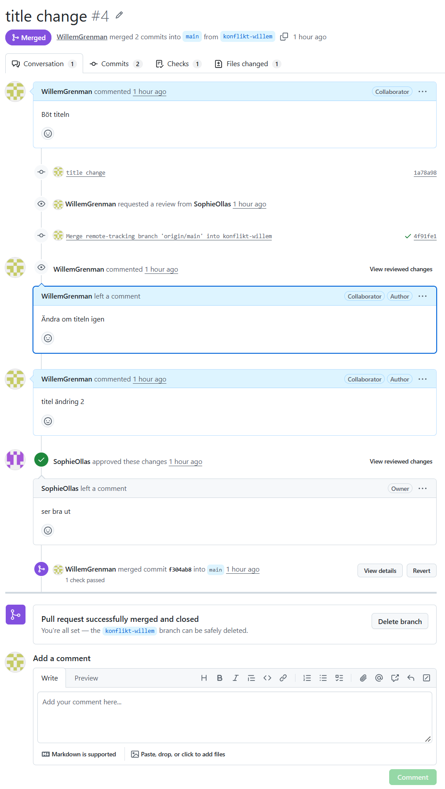

## Vad vi gjorde utanför repot

Vi skapade en ny ruleset:
- satt enforcement status 'active'
- Branch target + Default
- Required approvals 1

Vi testa vår nya ruleset i terminalen. Testet kunde inte pushas, eftersom den inte följde reglerna. Alltså ruleseten funkar så som den ska.

Sophie gjorde uppdrag A, alla test gick igenom och sedan laga hon en pull request.

Willem reviewa pull requesten och testa Sophies kod. Testen gick igenom, han approvea pull requesten.

Sophie mergea add-get-item ti main.

Willem laga uppdrag B. Han laga en :root i style.css filen, där han satt t.ex. hårdkodade färger. 

Han sedan gjorde en pull request som Sophie reviewa och approvea, efter att ha kolla på frontenden med docker kommandon. 

Vid sista steget gjorde Sophie och Willem en ändring till titeln h1 på frontenden och committa och pusha samtidigt. 

Sophie gjorde till först en pull request som gick igenom, sen när Willem gjorde sin PR så sto det att det inte går att merga (syns på bilden i konsolen).

Willem försökte då via konsolen merga dom, som inte funka, så istället gick han till index filen, to bort bådas rader av kod och skrev en helt ny rad, där han inkluderar bådas namn.

Sedan gick han och uppdatera PR:n, och så lyckades han mergea. 