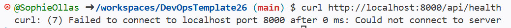
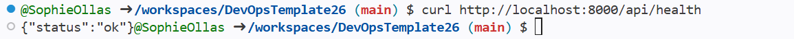
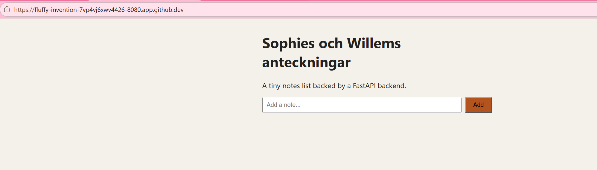
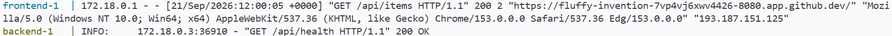
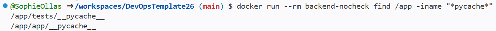
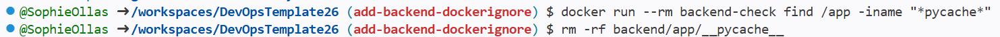
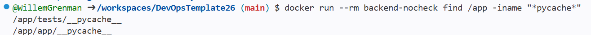
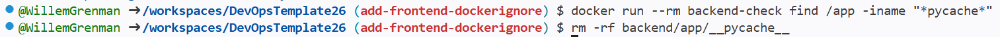
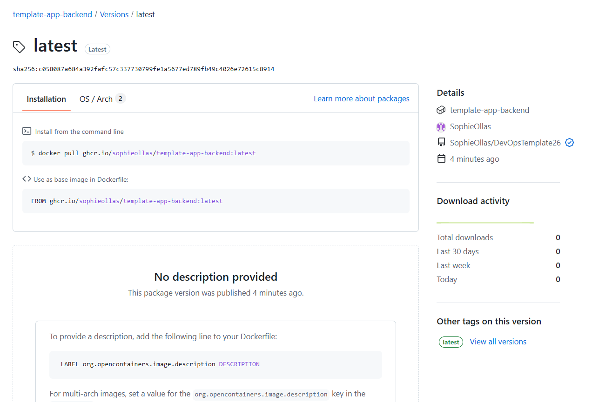

## Steg 1

1. FROM python:3.12-slim

2. För att försnabba processen när docker byggs upp. Den måste inte bygga om requirements.txt varje gång.

3. Nej

Testa portet:

## Steg 3

Vi körde appen med docker compose och öppna den på port 8080 på webbläsaren.

Tjänsterna visa 200 OK i terminalen under docker compose up.

## Steg 4

Sophie gjorde för backenden en .dockerignore fil, som bl.a. ignorer cache filer. Före .dockerignore filen:

Efter .dockerignore filen:

Samma för Willem:

## Steg 5

Vi generera en token enligt instruktionerna och logga in med commandon:

export CR_PAT=<er-token>
echo $CR_PAT | docker login ghcr.io -u <ert-användarnamn> --password-stdin

Och så gjorde vi docker compose build. Här ser man på Package fliken det som pushades:

