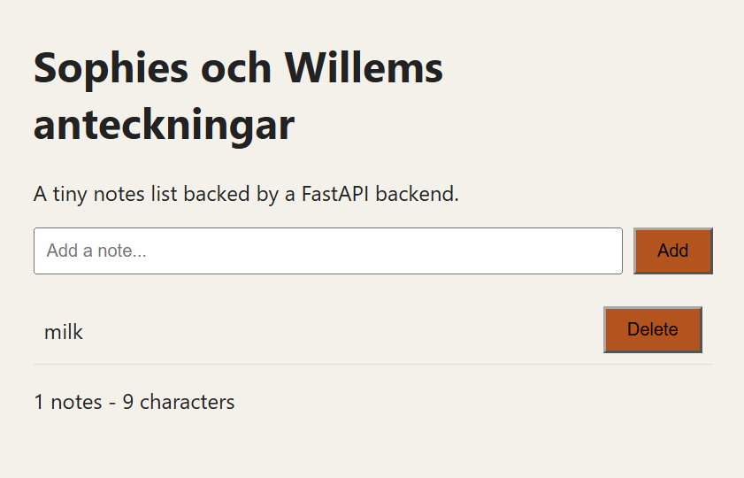
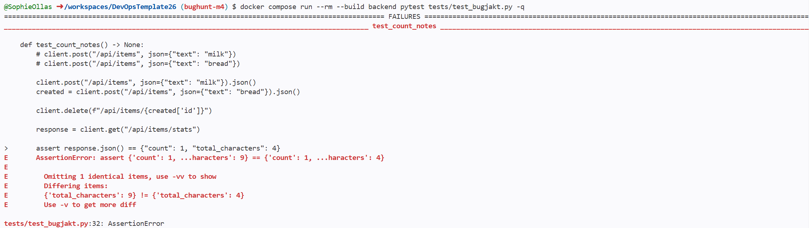
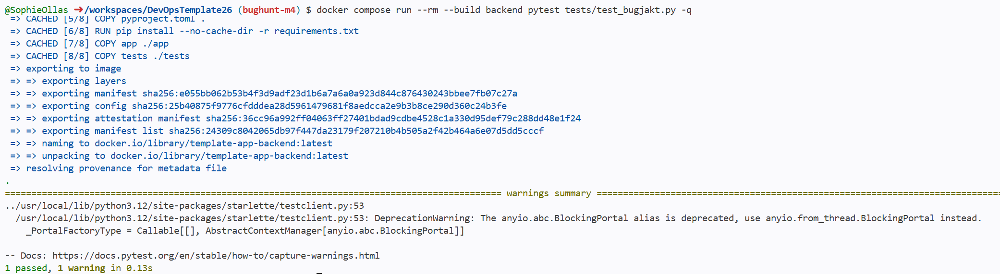

## M4

Vi fick symptom på fel ordning av kod. Detta fixa vi igenom att flytta på /api/items/stats koden i main.py ovanför vår /api/items/{item_id} som vi laga i M2. Efter det var alla test gröna.

1. När vi första gången körde vårt test faila de, testet förväntade sig count 1 och characters 4 men fick istället count 1 och characters 9. Alltså, mängden characters förändrades inte efter att man to bort "bread".

2. En förlkaring till varför de missade det här, var säkert p.g.a. att de kolla bara på nya koden som skrevs och glömde uppdatera app.delete. Det fanns inte heller ett test som räknar vad värdena blir efter att en item är borttagen, därför gick också alla test igenom.

3. Vi fixade problemet med att lägga till två rader av kod i app.delete. Den behövde bara räkna minus characters som den borttagna itemen hade.

4. Det skulle ha behövt det testet som vi lagade. Då skulle den inte ha nått main branchen.