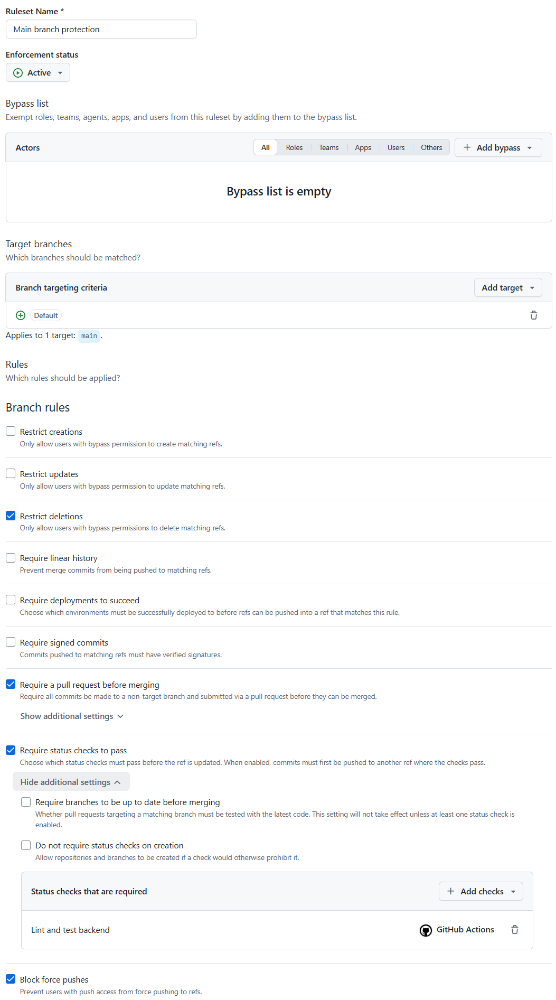
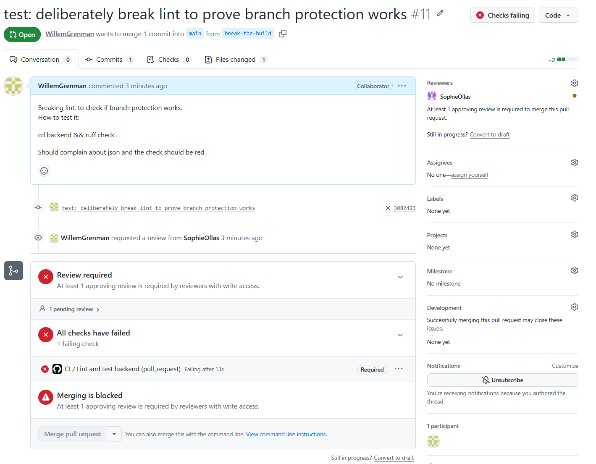
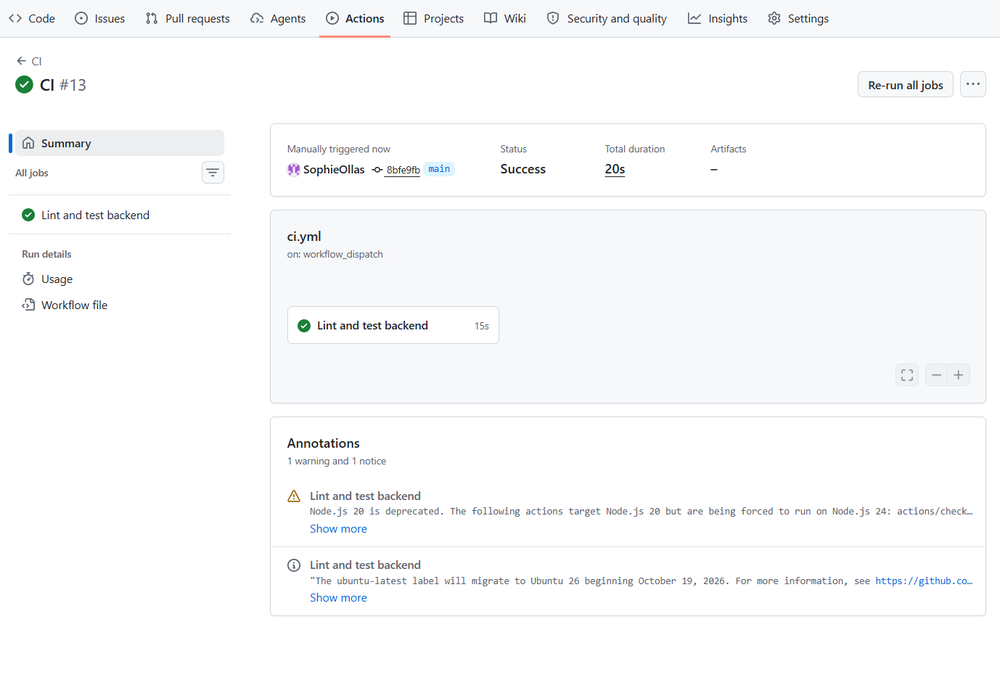

## Steg 1

Öppnade rulesets och kryssa för "require status checks to pass" och lade till "Lint and test backend" under Add checks (+).

## Steg 2

Willem skrev in en ny rad kod 'import json', som påflit ska vara oanvänd för att checka att uppdaterade branch protection fungerar. När han gjorde sin PR blev checken röd, som förväntat. Sophie lämna en rad kommentar där importen var. 

## Steg 3

Willem to bort den oanvända raden kod och pusha pånytt. Sen blev alla checks gröna och man kunde merga.

## Steg 4

Sophie for in på filen ci.yml och lade till en rad kod 'workflow_dispatch:' i 'on:' blocket. Sedan pusha hon den. Willem reviewa och sen merge. 

I Actions fliken i CI hittade man nu en Run workflow knapp. Sophie valde main och sedan run workflow. 

