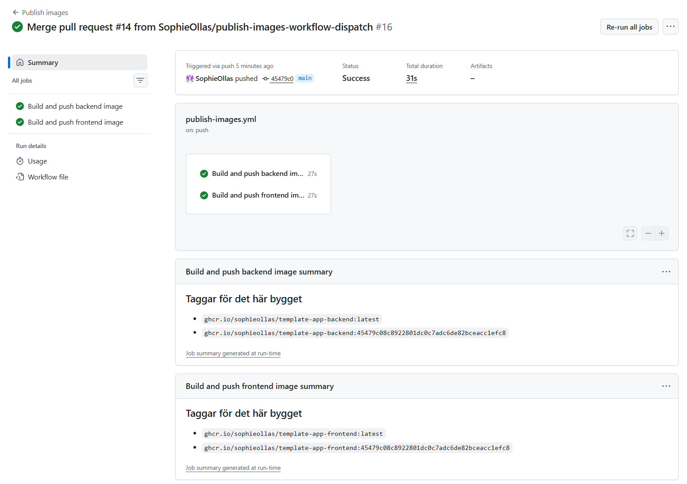
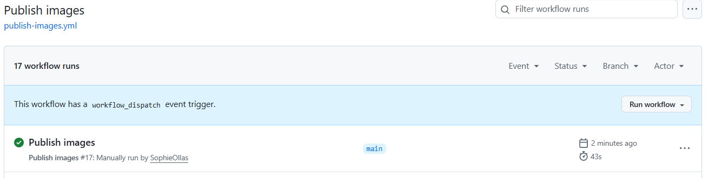
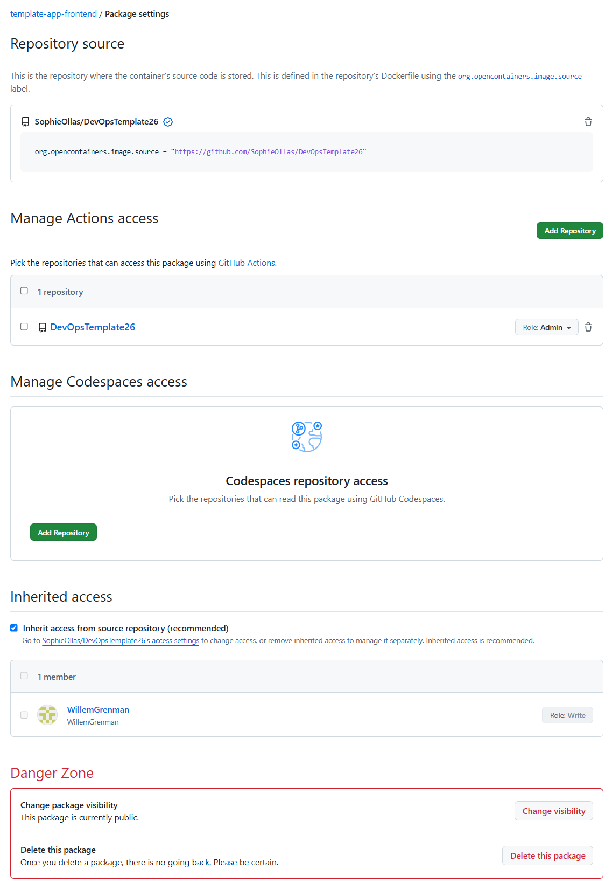
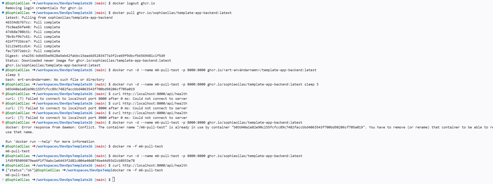
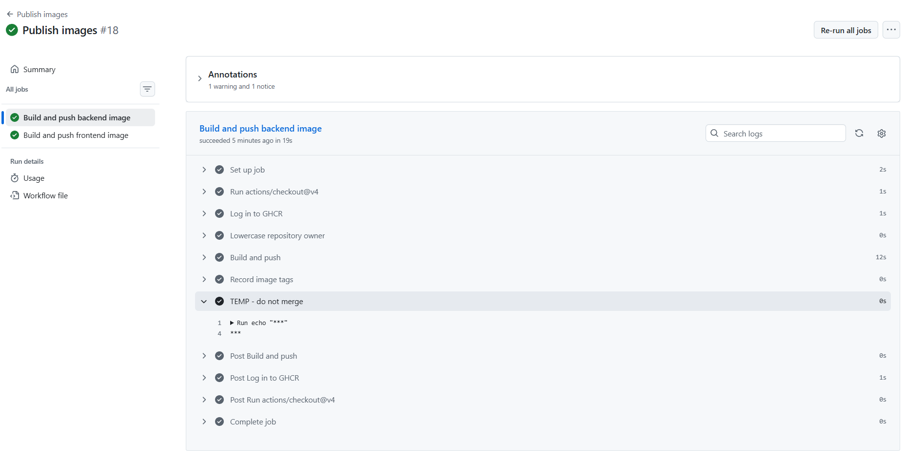

M6

## Steg 3

Sophie lade in ändringar i publish-images filen, som instruerat och gjorde en PR. Efter mergen for vi in på Actions fliken och kollade på senaste körningen i publish-images workflow. Båda jobben var gröna och taggarna syntes i summary.

Vi gjorde även en manuell Run workflow i Public images på main branchen. Det fungerade.

## Steg 4

Båda paketen var redan färdigt public.

## Steg 5

Vi logga ut ur ghcr och pulla en image. Vi testa att run med sleep 3, men curl faila. Så vi gjorde det pånytt utan sleep 3 och sen visa curl status: ok.

## Steg 6

Willem utförde steg 6. Han la till en temporär rad av kod i build-and-push-backend. Sedan pusha han den. Sen gick han till Publish images workflowen och tryckte run workflow på hans egna branch. Så kunde man se *** istället för klartext. Efteråt radera/städa han upp temporära test koden. 

