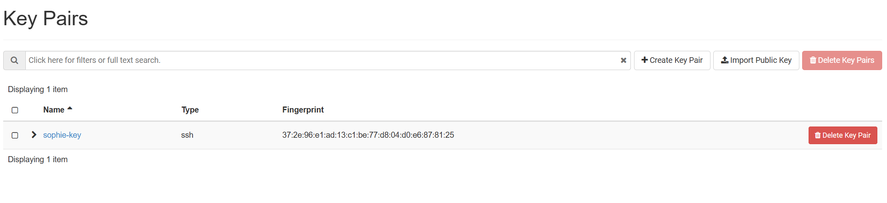
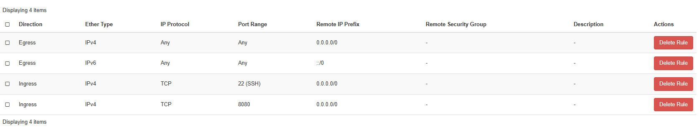
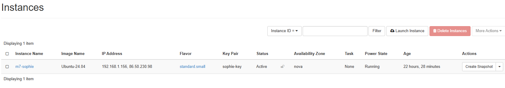
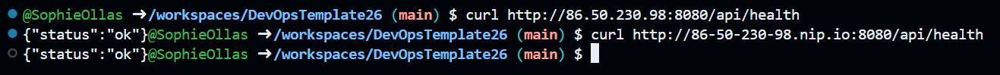
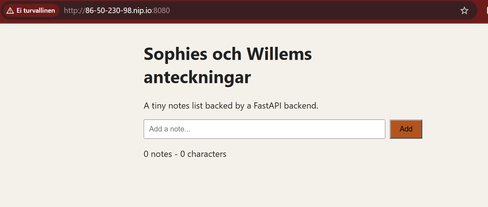

## Steg 2

Sophie körde kommandot cat för att kopiera sin publika ssh nyckel. Sedan skapade hon en ny nyckel i Key Pairs. Dit klistra hon in ssh nyckeln.

## Steg 3

Sophie skapade en ny security group. Där satt hon in två nya regler. En regel för SSH och en för custom TCP rule.

## Steg 5

Efter att instansen blev skapad tryckte Sophie på create snapshot. Där skapade hon en floating IP adress och koppla den till sin port. Sen tryckte hon associate och så blev det möjligt att koppla till VMen utifrån.

## Steg 10

Willem ladda ner docker på VMen och fick pullat både frontend och backend imagen. Sedan testa han med curl om allt visar ok, som det gjorde. Och han fick upp frontend webbsidan via nip.io.

