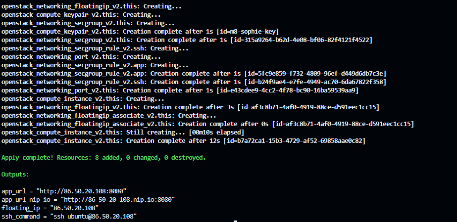
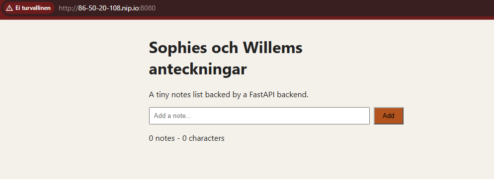
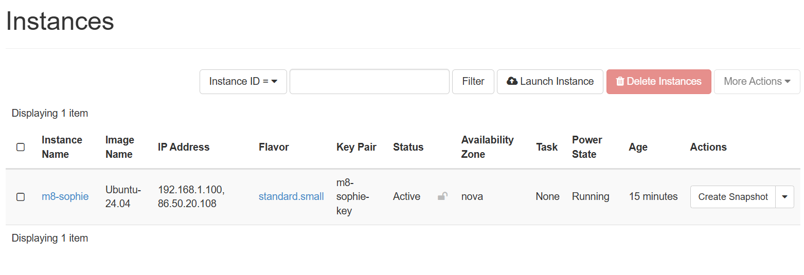
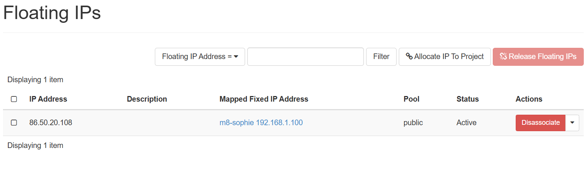
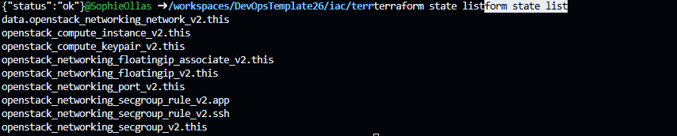
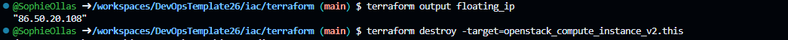
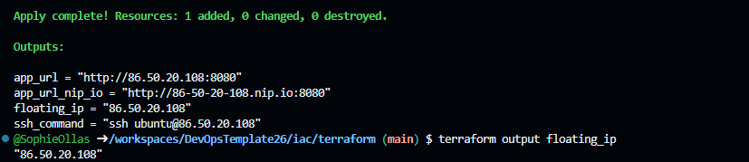

## Steg 4

Sophie körde terraform init och sedan terrafomr plan. Hon läste igenom planen. Efter det applicera hon allt med terraform apply.

## Steg 5

Sophie verifiera att nya floating ip:n fungerar. Båda curl kommandon kom tillbaka som status: ok. Frontenden syntes också på webbläsaren med nya ip:n.

## Steg 6

Efter att ha bekräftat att nya ip:n fungerar, gick vi in på instances och raderade m7:ans VM. Sen gick vi till float ips och raderade VM:ens floating ip.

## Steg 7

Willem skrev ut terraform state list. Som listar ut allt som terraform bokför.

## Steg 8 

Willem skrev ut ipen för destroy. Sedan destroya han instansen och körde om terrafomr apply. Så skrev han ut ipen igen. 

