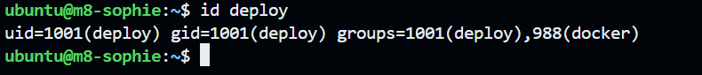
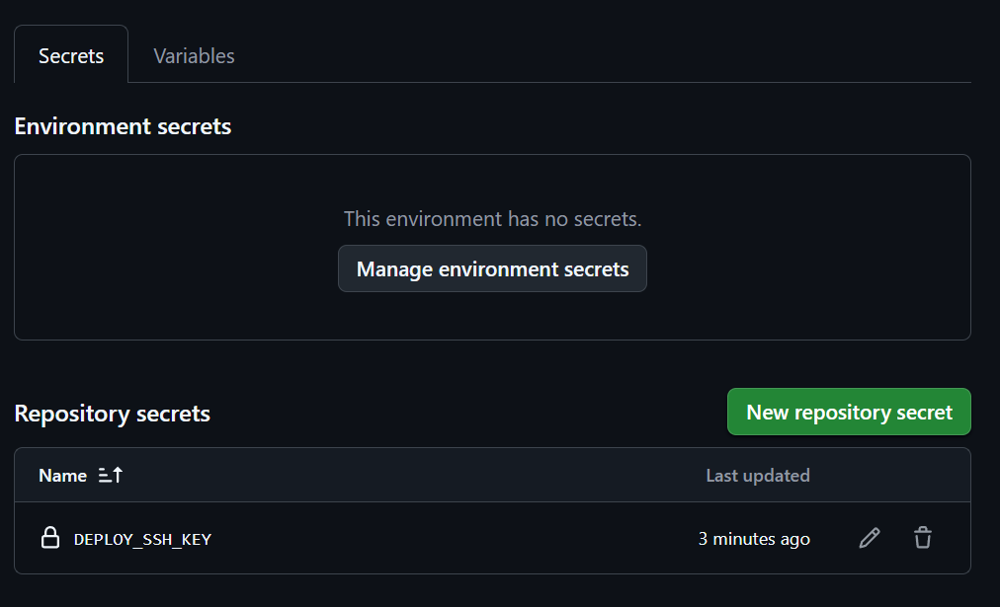
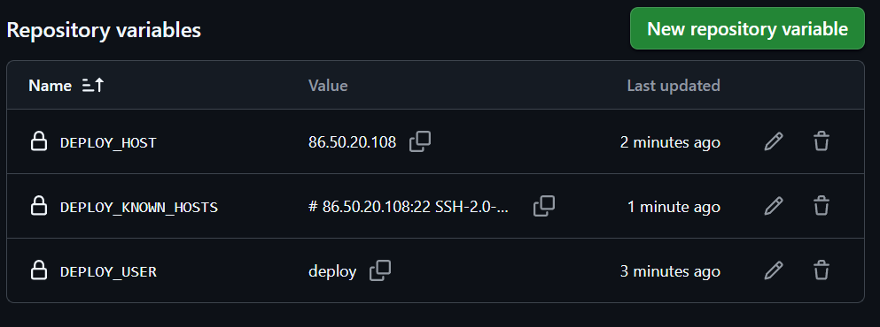
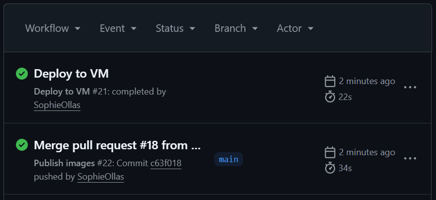
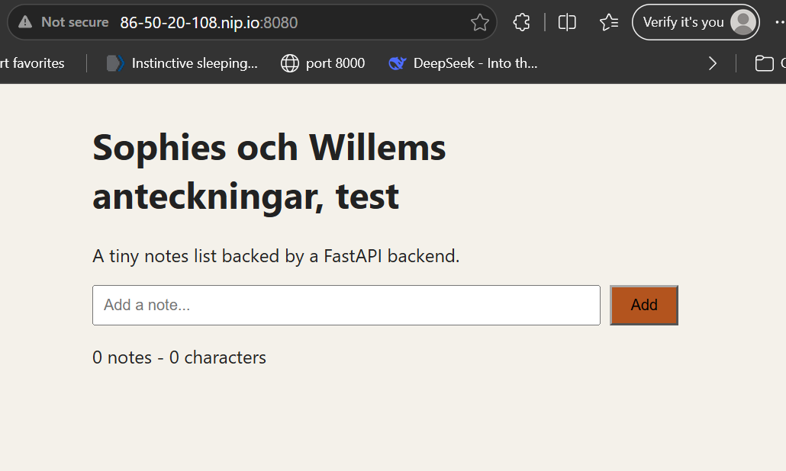

## Steg 3

Sophie laga en ny ssh nyckel. Sen satt hon den in på VM:en. Sen körde hon id deploy.

## Steg 6

I repons settings på GitHub fo vi in på secrets and variables. Där skapa sophie först sin ssh key, där hon satte sin private ssh nyckel. Willem gjorde resten på variables.

## Steg 9

Efter att Willem approvea PR:en så gick han till Actions fliken. Där såg han att Publish images blev till först grönt. Efter en stund blev också Deploy to VM grönt.

## Steg 10

Vi verifiera att ändringen i frontend syntes via curl, det gjorde den. Sen kolla vi status som visa ok. Till slut kolla vi hur frontenden såg ut på webbläsaren, där kunde man också se ändringen.

